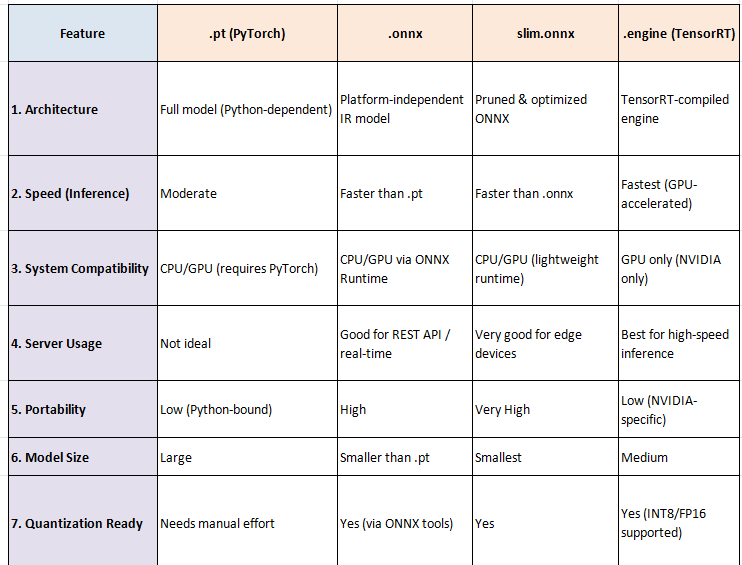

##  Model Format Comparison & Usage (R\&D Overview)

### Objective

When deploying deep learning models, the original `.pt` (PyTorch) format is often not optimal for speed or compatibility. To make models faster and more portable, we convert them into formats like `.onnx`, `.engine`, or `slim.onnx`.
This section explores **how each format works**, **where it fits best**, and provides a side-by-side comparison.

---

### 🔁 Conversion Flow Overview

```
.pt (PyTorch)
   │
   ├──> .onnx (Intermediate, cross-platform format)
   │       └──> slim.onnx (Lightweight ONNX, optimized)
   │
   └──> .engine (TensorRT format for GPU inference)
   
```

Each format targets different usage scenarios — e.g., `.onnx` for platform portability, `.engine` for GPU inference, and `slim.onnx` for lightweight deployment.

---

## 📊 Comparison Table: `.pt` vs `.onnx` vs `slim.onnx` vs `.engine`



---

## 💡 When to Use What?

| Format      | Best For                                  |
| ----------- | ----------------------------------------- |
| `.pt`       | Training, experimentation, research       |
| `.onnx`     | Cross-platform deployment, API serving    |
| `slim.onnx` | Mobile/edge deployment with low resources |
| `.engine`   | High-speed GPU inference in production    |

---

## 📝 Summary

* Start with `.pt` when training.
* Use `.onnx` for **standardized deployment** across platforms.
* Use `.engine` when you want **ultra-fast inference on NVIDIA GPUs**.
* Use `slim.onnx` for **minimal-resource environments** like mobile, Raspberry Pi, or browser inference.

---

